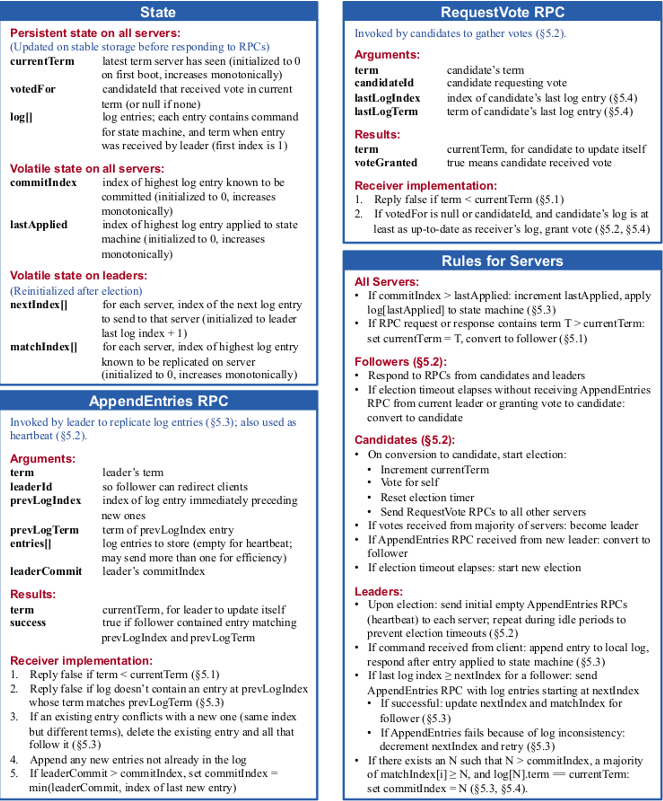

# raft-consensus
An implementation for raft consensus algorithm in Go

## Goals

> cluster.yaml

NODE (DB) (KAFKA)
=> receive some data from the client (SQL/REDIS command)
=> functions for processing this input and returning response back to the client
=> it should be always listening for new connections 

RAFT NODE SERVER
=> receive some data fomr the client ([]byte)
=> replicate the data between RAFT NODEs

+ RAFT library
=> include the raft settings so that there can be communication between this NODE and other NODES in the cluster
=> it should be able to participate in a clustered environment

raft-server1 --server "localhost:9091,localhost:9092"

raft-server2
raft-server3

type Store interface {
    GetLastUpdate() any
    Insert(data any)
}

database empty database
type calcState struct {
    students []string
}

type state interface {
    
}
raft.Start(stateMachine)
raft.addLog() // 
raft.getlatestlog() // return term and the index
stateMachine.Process() // commit

DS 
- Kafka (STORES)
  - Doesn't process messages

- DB (PRODUCER, CONSUMER)
  - Process messages

raft call one function, that can perform operations on the state machine
=> `create database postgres`
GOAL: Fault tolerance
state_machine empty => [postgres]

=> `create table table1`
state_machine [postgres] => [postgres,table1]

